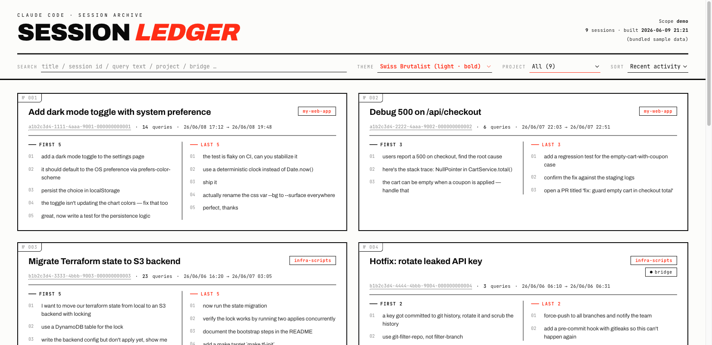
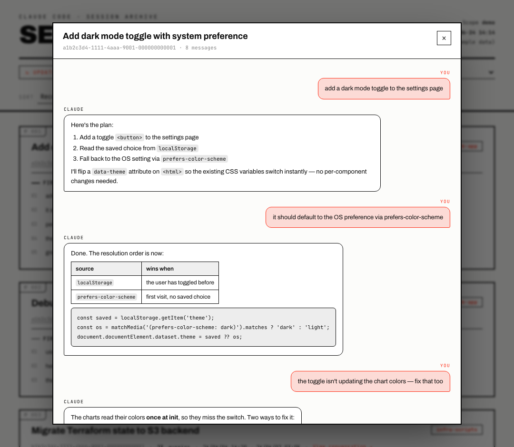

# Session Ledger

A single-file, zero-dependency browser for your [Claude Code](https://docs.claude.com/en/docs/claude-code) sessions.

Point it at your transcripts and it bakes a **self-contained HTML page** — one card per session, showing the auto-generated title, the session id, and the **first 5 and last 5 things you actually asked**. No server, no build step, no `node_modules`. Just Python's standard library and a browser.



> The screenshot above is the bundled demo. Try it yourself: open [`examples/demo.html`](examples/demo.html) in any browser — it's built from synthetic data, so it's safe to look at and share.

## Why

Claude Code keeps every session as a `.jsonl` transcript under `~/.claude/projects/`, but there's no easy way to skim *what each session was about* or to find that one session from last week. Session Ledger turns the pile of transcripts into a browsable, searchable index:

- **Title** — Claude Code's own auto-generated `ai-title` (falls back to your first prompt). Click it to read the **full conversation** (see below).
- **Session id** — click it to copy a ready-to-run `claude --resume <id>` command.
- **First N / Last N queries** — your real prompts, so you can tell at a glance how a session started and where it ended up.
- **Full conversation view** — click a session's title (or "View conversation") to open a chat modal with the whole back-and-forth, you and the assistant, with the assistant's markdown rendered. Loaded on demand, so it needs [serve mode](#live-refresh-optional).
- **Project tag** and a **`bridge` tag** for sessions driven through an external chat bridge.
- **Query count** and **time range**.

Search across titles, ids, project names and query text; sort by recency, age, length or title; filter by project. Four built-in themes, switchable live.

## Quick start

Requires **Python 3.8+** (standard library only — no `pip install`).

```bash
git clone https://github.com/fafa-ai-data-lab/claude-session-ledger.git
cd claude-session-ledger

python3 session_ledger.py --open      # scan ~/.claude/projects, build sessions.html, open it
```

That's it. `sessions.html` is a standalone file — move it anywhere, open it offline (re-run the script to refresh the data).

No transcripts yet, or just want to see it? Build the demo:

```bash
python3 session_ledger.py --demo --open
```

### Live refresh (optional)

The page has an **↻ Update** button in the header. Opened as a plain file it can only copy the regenerate command — a `file://` page isn't allowed to rescan your disk. To make the button actually re-scan on click, serve the page locally (still zero-dependency — Python's built-in HTTP server):

```bash
python3 session_ledger.py --serve --open   # serves at http://127.0.0.1:8765
```

Now clicking **↻ Update** rescans `~/.claude/projects` live and refreshes the list in place. `Ctrl-C` to stop the server.

### Read a full conversation

Each card only shows the first/last few prompts. To read **everything in a session** — its entire context, every message you sent *and* every reply the assistant gave, in order — click the session's **title** (or the **View conversation →** link on the card). A chat modal opens with the whole transcript: your messages and the assistant's as chat bubbles, with the assistant's replies rendered as markdown (headings, lists, tables, code blocks). Close it with `Esc`, the backdrop, or the ✕.

The full conversation is read straight from the original `.jsonl` **on demand** — it's never baked into the page (that would bloat the file enormously) — so this view needs **serve mode**: open the page via `--serve` as above, then click any session to load its complete context.



> Synthetic demo data. You can also deep-link straight to a conversation: `http://127.0.0.1:8765/?chat=<session-id>`.

## Usage

```text
python3 session_ledger.py [options]

  --project SUBSTR     only include projects whose directory name contains SUBSTR
  --projects-dir DIR   where Claude Code stores transcripts (default: ~/.claude/projects)
  --theme NAME         first-open theme: brutalist | terminal | blueprint | ledger
                       (default: brutalist — all four ship in the file and switch live)
  --queries N          how many earliest / latest queries to show per session (default: 5)
  --demo               build from bundled sample data instead of scanning (safe to share)
  --skip-permissions   copied resume command includes --dangerously-skip-permissions (opt-in)
  --open               open the result in your browser when done
  --serve [PORT]       serve the page locally (default port 8765) so the in-page
                       ↻ Update button can live-rescan on click; Ctrl-C to stop
  -o, --output PATH    output file (default: ./sessions.html)
```

Examples:

```bash
python3 session_ledger.py --project my-app          # one project only
python3 session_ledger.py --queries 8 --theme terminal
python3 session_ledger.py -o ~/Desktop/sessions.html --open
```

## Themes

All four are baked into every generated file — switch instantly from the **Theme** dropdown in the header (your choice is remembered via `localStorage`). `--theme` only sets which one shows on first open.

| theme | look |
|-------|------|
| `brutalist` (default) | White, hard black borders, red accent, oversized Archivo Black masthead, red drop-shadow on hover. Highest contrast, most legible. |
| `terminal` | Dark green CRT phosphor, monospace throughout, scanline overlay. Fits the CLI-log subject matter. |
| `blueprint` | Dark navy engineering drawing, cyan grid background, Chakra Petch squared type. |
| `ledger` | Warm paper, Fraunces serif, library-catalog index cards. Easy on the eyes. |

Fonts load from Google Fonts when online and fall back to system serif/mono/sans offline.

## Privacy

**The generated `sessions.html` embeds your real prompts.** Treat it like your transcripts themselves:

- Everything runs locally. The page makes no network calls except loading web fonts (and you can drop the `<link>` for fully offline use).
- `sessions.html` is **git-ignored** by default so you don't accidentally publish it. Only `examples/demo.html` (synthetic data) is committed.
- Want to share a screenshot or a live demo? Use `--demo`, which never touches your real transcripts.

## How it works

For each `.jsonl` transcript the script streams the lines and keeps only genuine user input. A line is **not** counted as a query when it's:

- a slash command or its echoed output (`<command-name>`, `<local-command-stdout>`, …),
- a `tool_result` turn (tool output, not something you typed),
- a `meta` or sub-agent (`isSidechain`) message,
- pure harness injection (`<system-reminder>`, `<task-notification>`),
- a `[Request interrupted by user]` marker.

Chat-bridge messages (`<bridge_context>` + `<quoted_message>`) keep their real trailing text and get flagged with the `bridge` tag. The most recent `ai-title` record becomes the session title.

The result — id, title, first/last queries, counts, timestamps, project, bridge flag — is serialized to JSON and embedded in the HTML alongside the CSS/JS. That's why the output is fully self-contained.

The **full conversation** behind each session is deliberately *not* baked in (that would bloat the file enormously). Instead it's parsed from the original `.jsonl` on demand: under [serve mode](#live-refresh-optional) the page fetches `/api/session/<id>` when you open a session, and renders the turns as a chat (the assistant's markdown is rendered by a tiny built-in renderer — no third-party library).

## Tips

- **Resume a session:** click any session id to copy `claude --resume <id>`, then paste it in your terminal (run it from that project's directory). Add `--skip-permissions` when building if you want the copied command to include `--dangerously-skip-permissions`.
- **Find bridge sessions:** type `bridge` in the search box.
- **Live updates:** run with `--serve` (see Quick start) and the header's **↻ Update** button rescans your transcripts on click — no need to re-run the script.
- **Read a whole session:** click a session's title (or "View conversation") to open the full chat in a modal. Needs `--serve`, since the conversation is loaded on demand.

## License

[MIT](LICENSE).

---

### 中文简述

把 `~/.claude/projects/` 里的 Claude Code 会话转成一个**本地打开的单文件 HTML**：每个会话一张卡片，显示标题、session id（点击复制 `claude --resume` 命令）、**最早 5 条 + 最晚 5 条真实 query**、project 标签和 bridge 标签。支持搜索/排序/筛选，内置 4 套可实时切换的主题。零依赖（仅需 Python 3.8+），数据全程不出本机。生成的 `sessions.html` 含真实 prompt，已默认 gitignore；要演示/截图用 `--demo`（合成数据）。

```bash
python3 session_ledger.py --open        # 扫全部 project
python3 session_ledger.py --demo --open # 看示例
```
